```mermaid
flowchart TD

    START([🎬 New Launch]) --> A1

    %% ── STAGE 1: INPUT ─────────────────────────────────────
    A1["📋 Paste transcript\n─────────────────\nOptional:\n• focal point note\n• known audience keywords\n• related video list"]
    A1 --> DRAFT[("📁 LaunchRecord\nstate: draft")]
    DRAFT --> HG1{"👤 HITL — Input\n─────────────────\nReady to generate?\nor save & return later?"}
    HG1 -->|"save draft"| DRAFT

    HG1 -->|"▶ generate"| AN

    %% ── STAGE 2: ANALYSIS ──────────────────────────────────
    AN["🤖 Analysis prompt\n─────────────────\n• core idea\n• key value / promise\n• audience hints\n• identity keyword hints"]
    AN --> GENERATED[("📁 state: generated")]
    GENERATED --> HG2{"👤 HITL — Analysis\n─────────────────\nAccept · Edit · Regenerate?"}
    HG2 -->|"regenerate"| AN
    HG2 -->|"edit manually"| HG2

    HG2 -->|"✓ accept\nstate → reviewed"| HK

    %% ── STAGE 3: HOOKS ─────────────────────────────────────
    HK["🤖 Hooks prompt\n─────────────────\n• 10–20 hook angles\n• each tagged by type:\n  x_vs_y · only_one_worked\n  i_tried_x · problem_solution\n  contrarian_take · etc."]
    HK --> HG3{"👤 HITL — Hooks\n─────────────────\nSelect hooks to proceed\n(multi-select allowed)\n⚠️ Hook = ancestor of\nboth title AND thumbnail"}
    HG3 -->|"regenerate all"| HK
    HG3 -->|"edit a hook"| HG3
    HG3 -->|"⬆ back to Analysis"| HG2

    HG3 -->|"✓ select hooks"| TI

    %% ── STAGE 4: TITLES ────────────────────────────────────
    TI["🤖 Titles prompt\n─────────────────\n• ~10 candidates per selected hook\n• audience signal classification runs:\n  Primary / Secondary / Hidden\n  per known identity term"]
    TI --> HG4{"👤 HITL — Titles\n─────────────────\nSelect shortlist\nOverride audience placement?\n(e.g. promote BMAD to title\nor demote to badge)"}
    HG4 -->|"regenerate"| TI
    HG4 -->|"edit titles"| HG4
    HG4 -->|"⬆ back to Hooks"| HG3

    HG4 -->|"✓ select shortlist"| TH

    %% ── STAGE 5: THUMBNAILS ────────────────────────────────
    TH["🤖 Thumbnail prompt\n─────────────────\n• 1–2 concepts per selected hook\n  (NOT derived from title)\n• thumbnail text options\n• badge suggestions for\n  Secondary audience signals"]
    TH --> HG5{"👤 HITL — Thumbnails\n─────────────────\nSelect concept + text\nAccept / reject badge\nsuggestions"}
    HG5 -->|"regenerate"| TH
    HG5 -->|"edit concept description"| HG5
    HG5 -->|"⬆ back to Hooks"| HG3

    HG5 -->|"✓ select"| DE

    %% ── STAGE 6: DESCRIPTION ───────────────────────────────
    DE["🤖 Description prompt\n─────────────────\n• synopsis (above-fold)\n• chapters\n• related-video suggestions\n• placeholders:\n  affiliate · legal · CTA · brand\n• 10–15 YouTube keyword tags\n  (SEO support — not identity signals)"]
    DE --> HG6{"👤 HITL — Description\n─────────────────\nEdit slots · add/remove chapters\nadd/remove related videos\nselect / deselect keyword tags"}
    HG6 -->|"regenerate whole"| DE
    HG6 -->|"regenerate single slot"| HG6
    HG6 -->|"edit inline"| HG6

    HG6 -->|"✓ proceed"| RE

    %% ── STAGE 7: REVIEW & FINALIZE ─────────────────────────
    RE["Validate minimum completeness\n─────────────────\ntitle + thumbnail + description"]
    RE --> HG7{"👤 HITL — Finalize\n─────────────────\nReady to launch?"}
    HG7 -->|"⬆ back to any earlier stage"| HG2
    HG7 -->|"✓ finalize\nstate → finalized"| DONE

    %% ── DONE ───────────────────────────────────────────────
    DONE(["✅ LaunchRecord · finalized\n─────────────────\nCopy / export:\n  title · thumbnail text\n  description · keyword tags\n  chapter list\n─────────────────\n(record persists regardless)"])

    DONE -->|"any edit\nstate → reviewed"| HG6

    %% ── STALE FLAG NOTE ────────────────────────────────────
    STALE_NOTE["⚠️ stale flag — orthogonal to state\n─────────────────\nSet automatically when a stage regenerates\nbut downstream stages have not been re-run.\nUser can re-run downstream or ignore.\n\nneeds_re_run flag: user explicitly marks\na stage to revisit later."]

    %% ── RECORD PERSISTS NOTE ───────────────────────────────
    PERSIST_NOTE["💾 LaunchRecord exists from\nthe moment transcript is submitted.\nClosing the app loses nothing.\nPause / resume freely at any stage."]

    %% ── STYLING ────────────────────────────────────────────
    classDef sysAction   fill:#dbeafe,stroke:#3b82f6,color:#1e3a5f
    classDef humanGate   fill:#fef9c3,stroke:#ca8a04,color:#713f12
    classDef stateNode   fill:#f3f4f6,stroke:#6b7280,color:#374151
    classDef doneNode    fill:#dcfce7,stroke:#16a34a,color:#14532d,font-weight:bold
    classDef noteNode    fill:#fff7ed,stroke:#ea580c,color:#7c2d12

    class AN,HK,TI,TH,DE,RE sysAction
    class HG1,HG2,HG3,HG4,HG5,HG6,HG7 humanGate
    class DRAFT,GENERATED stateNode
    class DONE doneNode
    class STALE_NOTE,PERSIST_NOTE noteNode
```

# FliLaunch — Launch Workflow Diagram

HITL = Human-in-the-Loop gate. Every stage requires an explicit human decision before advancing.
Back-arrows show where the user can return to fix earlier decisions.

> Source of truth: `docs/workflows/launch-workflow.md` and `docs/youtube-launch-optimizer-spec-v1.md`.
> If this diagram disagrees with those docs, those docs win — update this diagram.

---



---

## HITL Moments Summary

| Stage | Human decision | Can go back to |
|-------|---------------|----------------|
| **① Input** | Submit transcript + optional inputs; trigger generation | — |
| **② Analysis** | Accept / edit / regenerate core idea + audience hints | — |
| **③ Hooks** | Multi-select which hook angles drive titles + thumbnails | ② Analysis |
| **④ Titles** | Select shortlist; optionally override audience placement | ③ Hooks |
| **⑤ Thumbnails** | Select concept + text; accept/reject badge suggestions | ③ Hooks |
| **⑥ Description** | Edit slots inline; add/remove chapters; select keyword tags | — |
| **⑦ Finalize** | Explicitly mark launch ready | Any earlier stage |
| **Post-finalize** | Any edit reopens the record | ⑥ Description |

## State Machine

```
draft ──▶ generated ──▶ reviewed ──▶ finalized
                                         │
                         ◀───────────────┘ (any edit)

Orthogonal flags (independent of state):
  stale        — upstream changed; downstream re-run advisable
  needs_re_run — user explicitly flagged a stage to revisit
```

## Key design rules visible in this flow

- **No auto-advance**: every stage transition requires a human action. The tool never assumes.
- **Hook is the ancestor**: thumbnails come from hooks, not titles. Both TI and TH branch from HG3.
- **Regenerate ≠ replace**: titles/thumbnails/hooks append; analysis/description replace.
- **Record persists from transcript submission**: pause/resume freely; closing the app loses nothing.
- **Finalized is not published**: YouTube owns published-state. Finalized = ready to copy externally.
